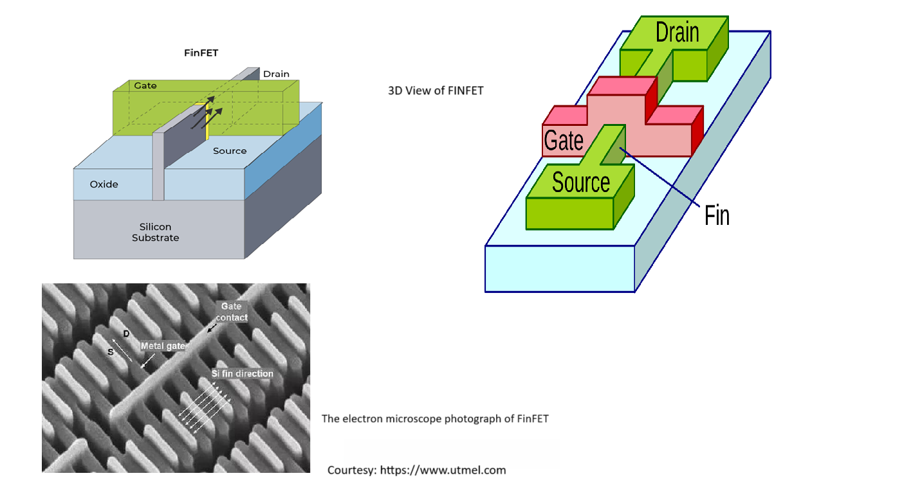

#            FINFET Circuit Design and Charecterization
## **Introduction**
**What is FinFET?**

A FinFET (Fin Field-Effect Transistor) is a modern non-planar transistor where the channel is formed in a thin vertical silicon fin controlled by a gate that wraps around three sides. This 3D structure improves electrostatic control, reduces leakage, and enables higher performance compared to traditional planar MOSFETs. FinFETs became the standard transistor design for advanced semiconductor nodes such as 14 nm, 10 nm, and 7 nm, and often use multiple fins in parallel under a single gate to boost drive strength.

**ASAP7NM PDK**

The ASAP 7nm PDK is an open-source process design kit for the 7nm technology node, providing design rules, models, and guidelines to optimize performance, power, and area (PPA). It supports multiple EDA flows, includes process variation and DFM features, and ensures reliable fabrication. Leveraging FinFET technology, the PDK enables higher transistor performance with lower leakage, along with strong power management capabilities. Designed to meet modern semiconductor demands, it is suited for applications like high-performance computing, mobile devices, and AI.

## **Characterization of CMOS VTC Using ASAP7NM PDK**

