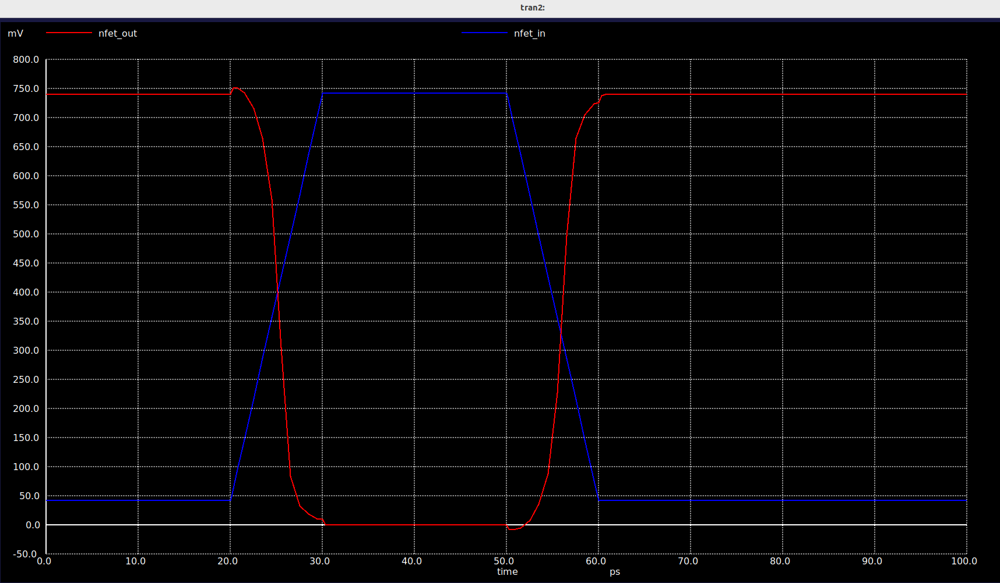
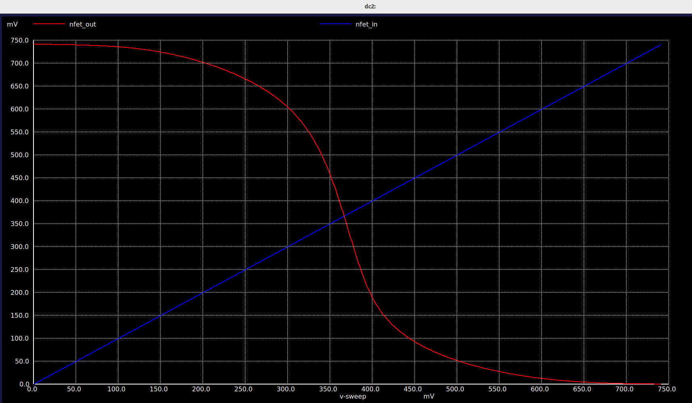
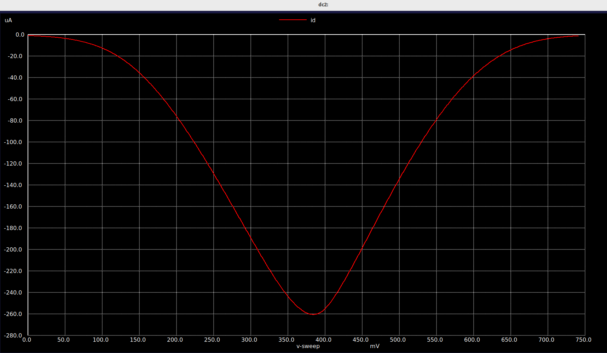
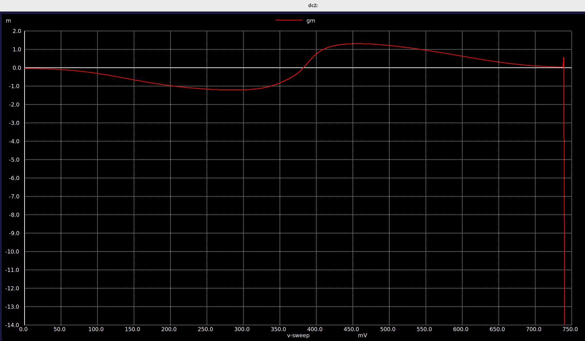
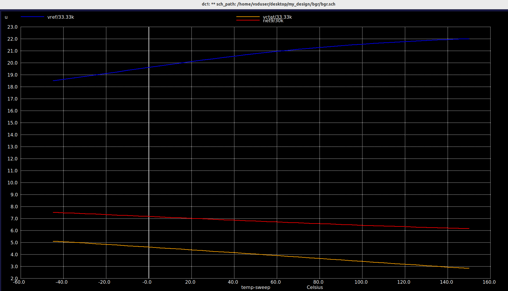

#            FINFET Circuit Design and Charecterization
## **Introduction**
**What is FinFET?**

A FinFET (Fin Field-Effect Transistor) is a modern non-planar transistor where the channel is formed in a thin vertical silicon fin controlled by a gate that wraps around three sides. This 3D structure improves electrostatic control, reduces leakage, and enables higher performance compared to traditional planar MOSFETs. FinFETs became the standard transistor design for advanced semiconductor nodes such as 14 nm, 10 nm, and 7 nm, and often use multiple fins in parallel under a single gate to boost drive strength.


**ASAP7NM PDK**

The ASAP 7nm PDK is an open-source process design kit for the 7nm technology node, providing design rules, models, and guidelines to optimize performance, power, and area (PPA). It supports multiple EDA flows, includes process variation and DFM features, and ensures reliable fabrication. Leveraging FinFET technology, the PDK enables higher transistor performance with lower leakage, along with strong power management capabilities. Designed to meet modern semiconductor demands, it is suited for applications like high-performance computing, mobile devices, and AI.


## **Characterization of CMOS VTC with ASAP7NM PDK**

A CMOS inverter is a logic gate made of a PMOS and an NMOS transistor. When the input is low, the PMOS pulls the output high, and when the input is high, the NMOS pulls the output low, thus producing the inverted signal.

__CMOS Inverter Schematic Diagaram__


__SPICE deck with unique voltage source:__

A small DC offset(ASCII value of arka/10) has been introduced at the input side to make the design unique and distinguishable.

```

** sch_path: /home/vsduser/Desktop/My_Design/FinFet_Inverter/apm_inverter_finfet.sch
**.subckt inverter_vtc
Xpfet1 nfet_out nfet_in vdd vdd asap_7nm_pfet l=7e-009 nfin=14

Xnfet1 nfet_out nfet_in GND GND asap_7nm_nfet l=7e-009 nfin=14

V1 nfet_in GND pulse(41.5m 741.5m 20p 10p 10p 20p 500p 1)
V2 vdd GND 741.5m

**** begin user architecture code


.dc V1 0 741.5m 1m
*.tran 1e-12 100e-12

.control
    * First run DC
    dc V1 0 741.5m 1m
    run

    *DC measurements
    meas dc v_th when nfet_out = nfet_in
    plot nfet_out nfet_in
    
    let gain_av = abs(deriv(nfet_out))
    meas dc max_gain max gain_av
    let gain_target = max_gain * 0.999
    meas dc vil find nfet_in when gain_av = gain_target cross=1
    meas dc voh find nfet_out when gain_av = gain_target cross=1
    meas dc vih find nfet_in when gain_av = gain_target cross=2
    meas dc vol find nfet_out when gain_av = gain_target cross=2
    let nmh = voh - vih
    let nml = vil - vol
    print v_th max_gain vil voh vih vol nmh nml
    
    *Transconductance
    
    let id = v2#branch
    let gm = real(deriv(id, nfet_in))
    meas dc gm_max MAX gm
    plot gm
    let r_out= deriv(nfet_out,id)
    plot r_out
    plot id
     * Transient measurements
    tran 1e-12 100e-12
    meas tran tpr when nfet_in = 0.367 rise = 1
    meas tran tpf when nfet_out = 0.367 fall = 1
    let tp = (tpr + tpf) / 2
    let trans_current = v2#branch
    meas tran id_pwr integ trans_current from=2e-11 to=6e-11
    **let pwr = id_pwr * 0.7
    let pwr = id_pwr * 0.742
    let power = abs(pwr / 40e-12)
    print tpr tpf tp id_pwr pwr power
    plot nfet_out nfet_in
  
    tran 0.1 100p                         
     
    meas tran tr when nfet_in=0.074 RISE=1 
    meas tran tf when nfet_out=0.675 FALL=1 
   
    let t_delay = tr + tf                  
    print t_delay                         
    let f = 1/t_delay                     
    print f                         
    
        

    

.endc


**** end user architecture code
**.ends
.GLOBAL GND
**** begin user architecture code

.subckt asap_7nm_pfet S G D B l=7e-009 nfin=14
	npmos_finfet S G D B BSIMCMG_osdi_P l=7e-009 nfin=14
.ends asap_7nm_pfet

.model BSIMCMG_osdi_P BSIMCMG_va (
+ TYPE = 0

************************************************************
*                         general                          *
************************************************************
+version = 107             bulkmod = 1               igcmod  = 1               igbmod  = 0
+gidlmod = 1               iimod   = 0               geomod  = 1               rdsmod  = 0
+rgatemod= 0               rgeomod = 0               shmod   = 0               nqsmod  = 0
+coremod = 0               cgeomod = 0               capmod  = 0               tnom    = 25
+eot     = 1e-009          eotbox  = 1.4e-007        eotacc  = 3e-010          tfin    = 6.5e-009
+toxp    = 2.1e-009        nbody   = 1e+022          phig    = 4.9278          epsrox  = 3.9
+epsrsub = 11.9            easub   = 4.05            ni0sub  = 1.1e+016        bg0sub  = 1.17
+nc0sub  = 2.86e+025       nsd     = 2e+026          ngate   = 0               nseg    = 5
+l       = 2.1e-008        xl      = 1e-009          lint    = -2.5e-009       dlc     = 0
+dlbin   = 0               hfin    = 3.2e-008        deltaw  = 0               deltawcv= 0
+sdterm  = 0               epsrsp  = 3.9             nfin    = 1
+toxg    = 1.8e-009
************************************************************
*                            dc                            *
************************************************************
+cit     = 0               cdsc    = 0.003469        cdscd   = 0.001486        dvt0    = 0.05
+dvt1    = 0.36            phin    = 0.05            eta0    = 0.094           dsub    = 0.24
+k1rsce  = 0               lpe0    = 0               dvtshift= 0               qmfactor= 0
+etaqm   = 0.54            qm0     = 2.183e-012      pqm     = 0.66            u0      = 0.0237
+etamob  = 4               up      = 0               ua      = 1.133           eu      = 0.05
+ud      = 0.0105          ucs     = 0.2672          rdswmin = 0               rdsw    = 200
+wr      = 1               rswmin  = 0               rdwmin  = 0               rshs    = 0
+rshd    = 0               vsat    = 60000           deltavsat= 0.17            ksativ  = 1.592
+mexp    = 2.491           ptwg    = 25              pclm    = 0.01            pclmg   = 1
+pdibl1  = 800             pdibl2  = 0.005704        drout   = 4.97            pvag    = 200
+fpitch  = 2.7e-008        rth0    = 0.15            cth0    = 1.243e-006      wth0    = 2.6e-007
+lcdscd  = 0               lcdscdr = 0               lrdsw   = 1.3             lvsat   = 1441
************************************************************
*                         leakage                          *
************************************************************
+aigc    = 0.007           bigc    = 0.0015          cigc    = 1               dlcigs  = 5e-009
+dlcigd  = 5e-009          aigs    = 0.006           aigd    = 0.006           bigs    = 0.001944
+bigd    = 0.001944        cigs    = 1               cigd    = 1               poxedge = 1.152
+agidl   = 2e-012          agisl   = 2e-012          bgidl   = 1.5e+008        bgisl   = 1.5e+008
+egidl   = 1.142           egisl   = 1.142
************************************************************
*                            rf                            *
************************************************************
************************************************************
*                         junction                         *
************************************************************
************************************************************
*                       capacitance                        *
************************************************************
+cfs     = 0               cfd     = 0               cgso    = 1.6e-010        cgdo    = 1.6e-010
+cgsl    = 0               cgdl    = 0               ckappas = 0.6             ckappad = 0.6
+cgbo    = 0               cgbl    = 0
************************************************************
*                       temperature                        *
************************************************************
+tbgasub = 0.000473        tbgbsub = 636             kt1     = 0               kt1l    = 0
+ute     = -1.2            utl     = 0               ua1     = 0.001032        ud1     = 0
+ucste   = -0.004775       at      = 0.001           ptwgt   = 0.004           tmexp   = 0
+prt     = 0               tgidl   = -0.007          igt     = 2.5
************************************************************
*                          noise                           *
************************************************************
**)
.control
pre_osdi /home/vsduser/Desktop/My_Design/FinFet_Inverter/bsimcmg.osdi
.endc


.subckt asap_7nm_nfet S G D B l=7e-009 nfin=14
	nnmos_finfet S G D B BSIMCMG_osdi_N l=7e-009 nfin=14
.ends asap_7nm_nfet

.model BSIMCMG_osdi_N BSIMCMG_va (
+ TYPE = 1
************************************************************
*                         general                          *
************************************************************
+version = 107             bulkmod = 1               igcmod  = 1               igbmod  = 0
+gidlmod = 1               iimod   = 0               geomod  = 1               rdsmod  = 0
+rgatemod= 0               rgeomod = 0               shmod   = 0               nqsmod  = 0
+coremod = 0               cgeomod = 0               capmod  = 0               tnom    = 25
+eot     = 1e-009          eotbox  = 1.4e-007        eotacc  = 1e-010          tfin    = 6.5e-009
+toxp    = 2.1e-009        nbody   = 1e+022          phig    = 4.2466          epsrox  = 3.9
+epsrsub = 11.9            easub   = 4.05            ni0sub  = 1.1e+016        bg0sub  = 1.17
+nc0sub  = 2.86e+025       nsd     = 2e+026          ngate   = 0               nseg    = 5
+l       = 2.1e-008        xl      = 1e-009          lint    = -2e-009         dlc     = 0
+dlbin   = 0               hfin    = 3.2e-008        deltaw  = 0               deltawcv= 0
+sdterm  = 0               epsrsp  = 3.9             nfin    = 1
+toxg    = 1.80e-009
************************************************************
*                            dc                            *
************************************************************
+cit     = 0               cdsc    = 0.01            cdscd   = 0.01            dvt0    = 0.05
+dvt1    = 0.47            phin    = 0.05            eta0    = 0.07            dsub    = 0.35
+k1rsce  = 0               lpe0    = 0               dvtshift= 0               qmfactor= 2.5
+etaqm   = 0.54            qm0     = 0.001           pqm     = 0.66            u0      = 0.0303
+etamob  = 2               up      = 0               ua      = 0.55            eu      = 1.2
+ud      = 0               ucs     = 1               rdswmin = 0               rdsw    = 200
+wr      = 1               rswmin  = 0               rdwmin  = 0               rshs    = 0
+rshd    = 0               vsat    = 70000           deltavsat= 0.2             ksativ  = 2
+mexp    = 4               ptwg    = 30              pclm    = 0.05            pclmg   = 0
+pdibl1  = 0               pdibl2  = 0.002           drout   = 1               pvag    = 0
+fpitch  = 2.7e-008        rth0    = 0.225           cth0    = 1.243e-006      wth0    = 2.6e-007
+lcdscd  = 5e-005          lcdscdr = 5e-005          lrdsw   = 0.2             lvsat   = 0
************************************************************
*                         leakage                          *
************************************************************
+aigc    = 0.014           bigc    = 0.005           cigc    = 0.25            dlcigs  = 1e-009
+dlcigd  = 1e-009          aigs    = 0.0115          aigd    = 0.0115          bigs    = 0.00332
+bigd    = 0.00332         cigs    = 0.35            cigd    = 0.35            poxedge = 1.1
+agidl   = 1e-012          agisl   = 1e-012          bgidl   = 10000000        bgisl   = 10000000
+egidl   = 0.35            egisl   = 0.35
************************************************************
*                            rf                            *
************************************************************
************************************************************
*                         junction                         *
************************************************************
************************************************************
*                       capacitance                        *
************************************************************
+cfs     = 0               cfd     = 0               cgso    = 1.6e-010        cgdo    = 1.6e-010
+cgsl    = 0               cgdl    = 0               ckappas = 0.6             ckappad = 0.6
+cgbo    = 0               cgbl    = 0
************************************************************
*                       temperature                        *
************************************************************
+tbgasub = 0.000473        tbgbsub = 636             kt1     = 0               kt1l    = 0
+ute     = -0.7            utl     = 0               ua1     = 0.001032        ud1     = 0
+ucste   = -0.004775       at      = 0.001           ptwgt   = 0.004           tmexp   = 0
+prt     = 0               tgidl   = -0.007          igt     = 2.5
************************************************************
*                          noise                           *
************************************************************
**)
.control
pre_osdi /home/vsduser/Desktop/asap_7nm_Xschem/APM/bsimcmg.osdi
.endc


**** end user architecture code
.end
    
```

__Transient_Waveform of CMOS_Inverter__



__Switching Threshold:__

The switching threshold of an inverter is the input voltage at which the input and output voltages are equal.At this point, both NMOS and PMOS conduct the same current, and the inverter flips its state.In a DC sweep, the switching threshold is the intersection point where the inverter transfer curve (VTC) crosses the line nfet_out=nfet_in.The switching threshold determines noise margins (how much noise the circuit can tolerate without flipping logic states).If it shifts too high or too low, the inverter becomes imbalanced: one transistor dominates, and noise tolerance suffers.Ideally it is equal to half of supply voltage.



Here it is 367mV.

SPICE Command :
```
 meas dc v_th when nfet_out = nfet_in
```

__Drain_Current:__

The drain current (ID) in a FET is the current flowing from drain to source, controlled by the gate voltage. The gate’s electric field modulates channel conductivity: a higher gate voltage makes the channel more conductive, increasing current. In the triode region, ID rises roughly linearly with drain-source voltage, while in the saturation region, it becomes nearly constant and independent of that voltage. Drain current is a fundamental parameter for transistor performance in both analog (amplifiers) and digital (logic circuits) applications.

SPICE Command:
```
.dc V1 0 741.5m 1m
let id = v2#branch
plot id

```



__Power_Consumption:__

Power Consumption is the product of integral of transient current and Vdd divided by the time period.
Spice Code:
```
 tran 1e-12 100e-12
    meas tran tpr when nfet_in = 0.367 rise = 1
    meas tran tpf when nfet_out = 0.367 fall = 1
    let tp = (tpr + tpf) / 2
    let trans_current = v2#branch
    meas tran id_pwr integ trans_current from=2e-11 to=6e-11
    let pwr = id_pwr * 0.742
    let power = abs(pwr / 40e-12)
    print power
```


__Propagation_Delay :__

The propagation delay of a logic gate is the time between the input reaching 50% of its transition and the output reaching 50% of its transition. The rise time (tr) is the time for the output to move from 10% to 90% of its maximum value, while the fall time (tf) is the time for it to drop from 90% to 10%. Some designs instead use 30–70% definitions, depending on requirements.
SPICE Command:
```
meas tran tpr when nfet_in=0.367 RISE=1 : Measures the rise time (tpr) when the input voltage reaches 0.35V
meas tran tpf when nfet_out=0.367 FALL=1 : Measures the fall time (tpf) when the output voltage reaches 0.35V. 
let tp = (tpf + tpr)/2 : Calculates the average propagation delay (tp) as the mean of the rise and fall times.
print tp : prints the Propagation Delay

```

__Gain(Av)__

Gain is defined as Change in output voltage to that of input voltage. Spice Commands to calculate gain
```
dc V1 0 741.5m 1m
let gain_av = abs(deriv(nfet_out))
meas dc max_gain max gain_av
print max_gain

```

__Noise_Margin:__

In a CMOS VTC, the noise margin indicates how much noise a circuit can tolerate without logic errors.It is described using two parameters: Noise Margin High (NMH) and Noise Margin Low (NML). NMH is the difference between the minimum guaranteed output high voltage (VOH) and the minimum input voltage recognized as a logic high (VIH). NML is the difference between the maximum output low voltage (VOL) and the maximum input voltage recognized as a logic low (VIL). Together, these values define the safety window within which the circuit can reliably interpret logic levels. A larger noise margin means the circuit is more robust against voltage fluctuations and external disturbances, ensuring stable digital operation.

SPICE Command:
```
.dc V1 0 741.5m 1m
meas dc vil find nfet_in when gain_av = gain_target cross=1
    meas dc voh find nfet_out when gain_av = gain_target cross=1
    meas dc vih find nfet_in when gain_av = gain_target cross=2
    meas dc vol find nfet_out when gain_av = gain_target cross=2
    let nmh = voh - vih
    let nml = vil - vol
print nmh nml
```

__Transconductance (Gm)__

Transconductance is defined as the ratio of change in drain current and change in Vgs (Gate-source Voltage). In our case, we already have drain current and VGS is input voltage which is nfet_in.

SPICE Command:

```
let gm = real(deriv(id, nfet_in))
    meas dc gm_max MAX gm
    plot gm
```


__Frequency (f):__

Here, the maximum operating frequency of the signal was determined based on the propagation delay time.

SPICE Command:
```
tran 0.1 100p                         
     
    meas tran tr when nfet_in=0.074 RISE=1 
    meas tran tf when nfet_out=0.675 FALL=1 
   
    let t_delay = tr + tf                  
    print t_delay                         
    let f = 1/t_delay                     
    print f                         

```
__Output_Resistance:__

The output resistance is defined as the ratio of output node voltage and the change in drain current.

__SPICE Commands :__

```
let r_out= deriv(nfet_out,id)   : Calculates the output resistance by taking the derivative of the output voltage with respect to the branch current.
plot r_out                      : Plots the output resistance.
```


__Simulation Result for threshold,gm,noise-margin,propagation delay(tp),frequency,power-consumption :__


## ASSIGNMENT for Module II


## Parameters Variation with W/L variation:


📄 [Assignment-table (PDF)](Table/VSD-TABLE.pdf)


## BGR(Bandgap Reference Circuit)

  __What is BGR__

  A bandgap reference circuit is a fundamental analog block designed to provide a stable and accurate reference voltage that is largely unaffected by changes in temperature, supply voltage, or manufacturing variations. It typically generates a voltage near 1.2 V, corresponding to the silicon bandgap energy. The circuit achieves temperature stability by combining two opposing voltage components: a PTAT (Proportional To Absolute Temperature) voltage that rises with temperature, and a CTAT (Complementary To Absolute Temperature) voltage that falls with temperature. By carefully balancing these contributions, the overall output becomes temperature-independent.

__Circuit_Diagram_of_BGR :__


A bandgap reference (BGR) maintains a stable voltage by combining two opposing temperature-dependent terms:

CTAT component: The base–emitter voltage (V_BE) of a BJT decreases with temperature.

PTAT component: The difference between two V_BE values at different current densities (ΔV_BE) increases linearly with temperature.

By properly scaling and summing PTAT with CTAT, their temperature variations cancel, producing a nearly constant reference of about 1.2 V, close to silicon’s bandgap voltage.


__Design Using Xschem :__


Here one Unique resistor value corresponding to the ASCII value of 'arka 'has been introduced to produce unique result.

__DC Analysis :__

SPICE CODE:
```

.dc temp -45 150 5
.dc VDD 0 1 0.1
.control
pre_osdi /home/vsduser/Desktop/asap_7nm_Xschem/bsimcmg.osdi
run
plot v(Vref) v(VCTAT)
plot v(Vref)-v(VCTAT)
plot v(VCTAT)
plot v(Vref)
let temp_coeff = deriv(v(Vref))/1.24
plot temp_coeff
plot net9/30k Vref/33.33k VCTAT/33.33k
plot abs(v2#branch)
.endc

```
__Simulation Plot:__





__SPICE code for Startup time:__
```
.tran 10u 2m uic
.temp -40
.control
pre_osdi /home/vsduser/Desktop/asap_7nm_Xschem/bsimcmg.osdi
run

meas tran vref_final FIND v(vref) AT=1.99m
meas tran t_99 WHEN v(vref)=0.99*vref_final FALL=1
print t_99
plot v(VCTAT)
plot v(Vref)

```


As per the diagram the startup time is around 11u s for 0.8V supply and at -40 C temperature.

__SPICE Deck for BGR netlist:__

```

** sch_path: /home/vsduser/Desktop/asap_7nm_Xschem/BGR.sch
**.subckt Bandgap_REference
Xpfet1 Vref net1 VDD net11 asap_7nm_pfet l=7e-009 nfin=14
Xpfet2 net1 net1 VDD net12 asap_7nm_pfet l=7e-009 nfin=14
Xpfet3 net7 net1 net1 net13 asap_7nm_pfet l=7e-009 nfin=14
Xpfet4 net8 net1 VDD net14 asap_7nm_pfet l=7e-009 nfin=14
Xpfet5 net2 net1 net6 net15 asap_7nm_pfet l=7e-009 nfin=14
Xpfet6 net6 net1 VDD net16 asap_7nm_pfet l=7e-009 nfin=14
Xnfet1 net5 net7 net8 net17 asap_7nm_nfet l=7e-009 nfin=14
Xnfet2 net5 net5 GND net18 asap_7nm_nfet l=7e-009 nfin=14
Xnfet3 net9 net7 net1 net19 asap_7nm_nfet l=7e-009 nfin=14
Xnfet4 net4 net4 GND GND asap_7nm_nfet l=7e-009 nfin=14
Xnfet5 net2 net2 net3 net20 asap_7nm_nfet l=7e-009 nfin=14
Xnfet6 net3 net3 net10 net21 asap_7nm_nfet l=7e-009 nfin=14
Xnfet7 net4 net4 GND GND asap_7nm_nfet l=7e-009 nfin=14
Xnfet8 VCTAT VCTAT GND net22 asap_7nm_nfet l=7e-009 nfin=14
Xnfet9 net4 net4 GND GND asap_7nm_nfet l=7e-009 nfin=14
Xnfet10 net4 net4 GND GND asap_7nm_nfet l=7e-009 nfin=14
R1 Vref VCTAT 50k ac=1k m=1
R2 net9 net4 33k ac=1k m=1
V1 VDD GND 1
R3 net10 GND 415 ac=1k m=1
**** begin user architecture code

.dc temp -45 150 5
.dc VDD 0 1 0.1
.control
pre_osdi /home/vsduser/Desktop/asap_7nm_Xschem/bsimcmg.osdi
run
plot v(Vref) v(Vctat)
plot v(Vref)-v(ctat)
plot v(Vctat)
plot v(Vref)
let temp_coeff = deriv(v(Vref))/1.24
plot temp_coeff
plot net9/30k Vref/33.33k VCTAT/33.33k
plot abs(v2#branch)
.endc

.tran 10u 60u
.temp -125
.control
pre_osdi /home/vsduser/Desktop/asap_7nm_Xschem/bsimcmg.osdi
run

plot v(Vctat)
plot v(Vref)

.endc


**** end user architecture code
**.ends
.GLOBAL VDD
.GLOBAL GND
**** begin user architecture code

.subckt asap_7nm_pfet S G D B l=7e-009 nfin=14
        npmos_finfet S G D B BSIMCMG_osdi_P l=7e-009 nfin=14
.ends asap_7nm_pfet

.model BSIMCMG_osdi_P BSIMCMG_va (
+ TYPE = 0

************************************************************
*                         general                          *
************************************************************
+version = 107             bulkmod = 1               igcmod  = 1               igbmod  = 0
+gidlmod = 1               iimod   = 0               geomod  = 1               rdsmod  = 0
+rgatemod= 0               rgeomod = 0               shmod   = 0               nqsmod  = 0
+coremod = 0               cgeomod = 0               capmod  = 0               tnom    = 25
+eot     = 1e-009          eotbox  = 1.4e-007        eotacc  = 3e-010          tfin    = 6.5e-009
+toxp    = 2.1e-009        nbody   = 1e+022          phig    = 4.9278          epsrox  = 3.9
+epsrsub = 11.9            easub   = 4.05            ni0sub  = 1.1e+016        bg0sub  = 1.17
+nc0sub  = 2.86e+025       nsd     = 2e+026          ngate   = 0               nseg    = 5
+l       = 2.1e-008        xl      = 1e-009          lint    = -2.5e-009       dlc     = 0
+dlbin   = 0               hfin    = 3.2e-008        deltaw  = 0               deltawcv= 0
+sdterm  = 0               epsrsp  = 3.9             nfin    = 1
+toxg    = 1.8e-009
************************************************************
*                            dc                            *
************************************************************
+cit     = 0               cdsc    = 0.003469        cdscd   = 0.001486        dvt0    = 0.05
+dvt1    = 0.36            phin    = 0.05            eta0    = 0.094           dsub    = 0.24
+k1rsce  = 0               lpe0    = 0               dvtshift= 0               qmfactor= 0
+etaqm   = 0.54            qm0     = 2.183e-012      pqm     = 0.66            u0      = 0.0237
+etamob  = 4               up      = 0               ua      = 1.133           eu      = 0.05
+ud      = 0.0105          ucs     = 0.2672          rdswmin = 0               rdsw    = 200
+wr      = 1               rswmin  = 0               rdwmin  = 0               rshs    = 0
+rshd    = 0               vsat    = 60000           deltavsat= 0.17            ksativ  = 1.592
+mexp    = 2.491           ptwg    = 25              pclm    = 0.01            pclmg   = 1
+pdibl1  = 800             pdibl2  = 0.005704        drout   = 4.97            pvag    = 200
+fpitch  = 2.7e-008        rth0    = 0.15            cth0    = 1.243e-006      wth0    = 2.6e-007
+lcdscd  = 0               lcdscdr = 0               lrdsw   = 1.3             lvsat   = 1441
************************************************************
*                         leakage                          *
************************************************************
+aigc    = 0.007           bigc    = 0.0015          cigc    = 1               dlcigs  = 5e-009
+dlcigd  = 5e-009          aigs    = 0.006           aigd    = 0.006           bigs    = 0.001944
+bigd    = 0.001944        cigs    = 1               cigd    = 1               poxedge = 1.152
+agidl   = 2e-012          agisl   = 2e-012          bgidl   = 1.5e+008        bgisl   = 1.5e+008
+egidl   = 1.142           egisl   = 1.142
************************************************************
*                            rf                            *
************************************************************
************************************************************
*                         junction                         *
************************************************************
************************************************************
*                       capacitance                        *
************************************************************
+cfs     = 0               cfd     = 0               cgso    = 1.6e-010        cgdo    = 1.6e-010
+cgsl    = 0               cgdl    = 0               ckappas = 0.6             ckappad = 0.6
+cgbo    = 0               cgbl    = 0
************************************************************
*                       temperature                        *
************************************************************
+tbgasub = 0.000473        tbgbsub = 636             kt1     = 0               kt1l    = 0
+ute     = -1.2            utl     = 0               ua1     = 0.001032        ud1     = 0
+ucste   = -0.004775       at      = 0.001           ptwgt   = 0.004           tmexp   = 0
+prt     = 0               tgidl   = -0.007          igt     = 2.5
************************************************************
*                          noise                           *
************************************************************
**)
.control
pre_osdi /home/hprcse/Documents/test/bsimcmg.osdi
.endc


.subckt asap_7nm_nfet S G D B l=7e-009 nfin=14
        nnmos_finfet S G D B BSIMCMG_osdi_N l=7e-009 nfin=14
.ends asap_7nm_nfet

.model BSIMCMG_osdi_N BSIMCMG_va (
+ TYPE = 1
************************************************************
*                         general                          *
************************************************************
+version = 107             bulkmod = 1               igcmod  = 1               igbmod  = 0
+gidlmod = 1               iimod   = 0               geomod  = 1               rdsmod  = 0
+rgatemod= 0               rgeomod = 0               shmod   = 0               nqsmod  = 0
+coremod = 0               cgeomod = 0               capmod  = 0               tnom    = 25
+eot     = 1e-009          eotbox  = 1.4e-007        eotacc  = 1e-010          tfin    = 6.5e-009
+toxp    = 2.1e-009        nbody   = 1e+022          phig    = 4.2466          epsrox  = 3.9
+epsrsub = 11.9            easub   = 4.05            ni0sub  = 1.1e+016        bg0sub  = 1.17
+nc0sub  = 2.86e+025       nsd     = 2e+026          ngate   = 0               nseg    = 5
+l       = 2.1e-008        xl      = 1e-009          lint    = -2e-009         dlc     = 0
+dlbin   = 0               hfin    = 3.2e-008        deltaw  = 0               deltawcv= 0
+sdterm  = 0               epsrsp  = 3.9             nfin    = 1
+toxg    = 1.80e-009
************************************************************
*                            dc                            *
************************************************************
+cit     = 0               cdsc    = 0.01            cdscd   = 0.01            dvt0    = 0.05
+dvt1    = 0.47            phin    = 0.05            eta0    = 0.07            dsub    = 0.35
+k1rsce  = 0               lpe0    = 0               dvtshift= 0               qmfactor= 2.5
+etaqm   = 0.54            qm0     = 0.001           pqm     = 0.66            u0      = 0.0303
+etamob  = 2               up      = 0               ua      = 0.55            eu      = 1.2
+ud      = 0               ucs     = 1               rdswmin = 0               rdsw    = 200
+wr      = 1               rswmin  = 0               rdwmin  = 0               rshs    = 0
+rshd    = 0               vsat    = 70000           deltavsat= 0.2             ksativ  = 2
+mexp    = 4               ptwg    = 30              pclm    = 0.05            pclmg   = 0
+pdibl1  = 0               pdibl2  = 0.002           drout   = 1               pvag    = 0
+fpitch  = 2.7e-008        rth0    = 0.225           cth0    = 1.243e-006      wth0    = 2.6e-007
+lcdscd  = 5e-005          lcdscdr = 5e-005          lrdsw   = 0.2             lvsat   = 0
************************************************************
*                         leakage                          *
************************************************************
+aigc    = 0.014           bigc    = 0.005           cigc    = 0.25            dlcigs  = 1e-009
+dlcigd  = 1e-009          aigs    = 0.0115          aigd    = 0.0115          bigs    = 0.00332
+bigd    = 0.00332         cigs    = 0.35            cigd    = 0.35            poxedge = 1.1
+agidl   = 1e-012          agisl   = 1e-012          bgidl   = 10000000        bgisl   = 10000000
+egidl   = 0.35            egisl   = 0.35
************************************************************
*                            rf                            *
************************************************************
************************************************************
*                         junction                         *
************************************************************
************************************************************
*                       capacitance                        *
************************************************************
+cfs     = 0               cfd     = 0               cgso    = 1.6e-010        cgdo    = 1.6e-010
+cgsl    = 0               cgdl    = 0               ckappas = 0.6             ckappad = 0.6
+cgbo    = 0               cgbl    = 0
************************************************************
*                       temperature                        *
************************************************************
+tbgasub = 0.000473        tbgbsub = 636             kt1     = 0               kt1l    = 0
+ute     = -0.7            utl     = 0               ua1     = 0.001032        ud1     = 0
+ucste   = -0.004775       at      = 0.001           ptwgt   = 0.004           tmexp   = 0
+prt     = 0               tgidl   = -0.007          igt     = 2.5
************************************************************
*                          noise                           *
************************************************************
**)
.control
pre_osdi /home/hprcse/Documents/test/bsimcmg.osdi
.endc


**** end user architecture code
.end

```

